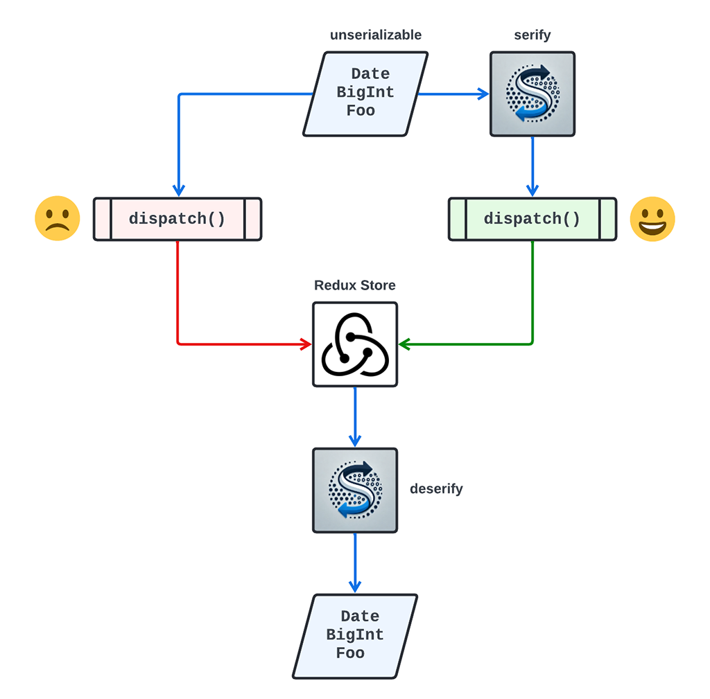

# serify-deserify

[](https://www.npmjs.com/package/@karmaniverous/serify-deserify)  <!-- TYPEDOC_EXCLUDE --> [](https://docs.karmanivero.us/serify-deserify) [](https://github.com/karmaniverous/serify-deserify/tree/main/CHANGELOG.md)<!-- /TYPEDOC_EXCLUDE --> [](https://github.com/karmaniverous/serify-deserify/tree/main/LICENSE)

<p align="center"></p>

**serify** - reversibly transform an unserializable value into a serializable one

**deserify** - do the exact opposite

## Why?

`JSON.stringify` and `JSON.parse` are a notoriously bad serializer/deserializer combination. They don't support important JavaScript types like `BigInt`, `Date`, `Map`, `Set`, and `undefined`. Thanks to backward compatibility risk, they probably never will.

There are tons of custom serializers that address this issue, notably [`serialize-javascript`](https://www.npmjs.com/package/serialize-javascript) and [`serializr`](https://www.npmjs.com/package/serializr). Unfortunately, some key JavaScript tools like [Redux](https://redux.js.org) explicitly depend on `JSON.stringify` & `JSON.parse`. So if you use Redux, none of those fancy serializers will help you get a `Date` or a `BigInt` into your store and back out again in one piece.

`serify` solves this problem by encoding those values (or structures containing them) into values that `JSON.stringify` _can_ serialize without throwing an exception. After these values are retrieved and deserialized with `JSON.parse`, `deserify` returns them to their original state.

## Usage

To install the package, run this command:

```bash
npm install @karmaniverous/serify-deserify
```

This package is ESM-only. CommonJS consumers on Node.js 20.19+ or 22.12+ can still load it with `require()`.

A simple example:

```js
import {
  serify,
  deserify,
  defaultOptions,
} from '@karmaniverous/serify-deserify';

// A BigInt test value.
const value = 42n;

const serified = serify(value, defaultOptions);
// { serifyKey: null, type: 'BigInt', value: '42' }

const deserified = deserify(serified, defaultOptions);
// 42n
```

Every example in this README is exercised by [`readme.test.ts`](https://github.com/karmaniverous/serify-deserify/tree/main/src/readme.test.ts). Review the unit tests for more examples of how to use [`serify`](https://github.com/karmaniverous/serify-deserify/tree/main/src/serify/serify.test.ts), [`deserify`](https://github.com/karmaniverous/serify-deserify/tree/main/src/deserify/deserify.test.ts), and [`createReduxMiddleware`](https://github.com/karmaniverous/serify-deserify/tree/main/src/createReduxMiddleware/createReduxMiddleware.test.ts).

## Serifiable Types

`serify` and `deserify` will work on values of any serifiable type.

A _serifiable type_ is any type that is:

- supported by `JSON.stringify` and `JSON.parse`, i.e. `null`, booleans, numbers, strings, plain objects, and arrays.
- natively supported by `serify`, i.e. `BigInt`, `Date`, `Map`, `Set`, `undefined`, null-prototype objects (`Object.create(null)`), and the numbers JSON can't represent (`NaN`, `Infinity`, `-Infinity` & `-0`).
- added to `serify` as a [custom type](#custom-configuration).
- composed exclusively of any of the above (e.g. an array of BigInt-keyed Maps of objects containing Sets of custom class instances).

Numbers that `JSON.stringify` can't round-trip (`NaN`, `Infinity` & `-Infinity` become `null`; `-0` becomes `0`) are serified as the `Number` type. Every other number passes through untouched. If your options don't include a `Number` type, `serify` [throws](#errors) on these values.

Only own, enumerable, string-keyed properties of objects are serified. As with `JSON.stringify`, symbol-keyed and non-enumerable properties are dropped.

Anything else (e.g. a symbol, a function, or an instance of a class that is not configured in your options) causes `serify` to [throw](#errors).

## serifyKey

`serify` works by converting unserializable values into structured objects that ARE serializable. Each one has the form `{ serifyKey, type, value }`.

`deserify` treats any plain object as a serified value if its `serifyKey` matches your options _and_ its `type` is one of your configured types. Consider the highly unlikely event that some data you want to `deserify` contains an object like this that was _not_ produced by `serify`:

```js
const data = { serifyKey: null, type: 'Date', value: 'Bar' };

deserify(data, defaultOptions);
// Invalid Date
```

In this case, simply add a non-null `serifyKey` of a serializable primitive type (meaning a `boolean`, `number`, or `string`) to your `options` object, and everything will work again:

```js
const keyedOptions = { ...defaultOptions, serifyKey: 'my-serify-key' };

deserify(data, keyedOptions);
// { serifyKey: null, type: 'Date', value: 'Bar' }
```

Objects whose `type` is not configured in your options are never deserified, whatever their `serifyKey`.

## Options

[Serifiable types](#serifiable-types) and the [`serifyKey`](#serifykey) are defined in an `options` object, which specifies the logic that converts each type to and from a serializable form.

### Default Configuration

Out of the box, the [`defaultOptions`](https://github.com/karmaniverous/serify-deserify/tree/main/src/options/defaultOptions.ts) object has a `null` `serifyKey` and supports these types:

| Type key     | Value                    | Serified `value`                |
| ------------ | ------------------------ | ------------------------------- |
| `BigInt`     | `bigint`                 | decimal string                  |
| `Date`       | `Date`                   | epoch milliseconds (`number`)   |
| `Map`        | `Map`                    | array of `[key, value]` entries |
| `Set`        | `Set`                    | array of values                 |
| `Undefined`  | `undefined`              | `null`                          |
| `NullObject` | null-prototype `object`  | plain object                    |
| `Number`     | `NaN`, `±Infinity`, `-0` | string, e.g. `'-Infinity'`      |

If you only need the default configuration, simply import the `defaultOptions` object and pass it to `serify` and `deserify`, as in the [Usage](#usage) example above.

### Custom Configuration

If you need to change the `serifyKey` or add custom types, you can create a new `options` object and pass it to `serify` and `deserify`.

`serify` finds the key of a value's type in your options like this:

1. A null-prototype object's key is `NullObject`.
2. Any other object whose prototype chain has a constructor (e.g. a class instance) is keyed by the value of its class's [Static Type Property](#static-type-property) if it has one, otherwise by its class name. The constructor is read from the prototype, so a property named `constructor` can't spoof it.
3. Anything else gets the type name reported by [`is-what`](https://www.npmjs.com/package/is-what)'s `getType` (e.g. `BigInt`, `Number`, `Undefined`, `Symbol`, `Function`).

```js
import {
  serify,
  deserify,
  defaultOptions,
} from '@karmaniverous/serify-deserify';

// A custom class.
export class Custom {
  constructor(p) {
    this.p = p;
  }
}

// A serify options object including support for the new custom type.
const customOptions = {
  ...defaultOptions,
  serifyKey: 42,
  types: {
    ...defaultOptions.types,
    Custom: {
      serifier: (value) => value.p,
      deserifier: (value) => new Custom(value),
    },
  },
};

// A Custom test value.
const customAnswer = new Custom(42);

const serified = serify(customAnswer, customOptions);
// { serifyKey: 42, type: 'Custom', value: 42 }

const deserified = deserify(serified, customOptions);
// Custom { p: 42 }
```

### Static Type Property

Normally, a type's key in the serify options object is the type's class name. If a class is dynamically generated (or its name is mangled by a minifier), this value may not be known at compile time, so it would not be possible to configure it into the options object in a static manner.

One option is to alter the options object at runtime. _Go nuts!_

Another is to import the `serifyStaticTypeProperty` symbol to create a static property on your class. Use its value as the type key in your options object.

```js
import {
  serify,
  deserify,
  defaultOptions,
  serifyStaticTypeProperty,
} from '@karmaniverous/serify-deserify';

// A custom class.
export class CustomFoo {
  static [serifyStaticTypeProperty] = 'Foo';

  constructor(p) {
    this.p = p;
  }
}

// A serify options object including support for the new custom type.
const customOptions = {
  ...defaultOptions,
  serifyKey: 42,
  types: {
    ...defaultOptions.types,
    Foo: {
      serifier: (value) => value.p,
      deserifier: (value) => new CustomFoo(value),
    },
  },
};

// A CustomFoo test value.
const customAnswer = new CustomFoo(42);

const serified = serify(customAnswer, customOptions);
// { serifyKey: 42, type: 'Foo', value: 42 }

const deserified = deserify(serified, customOptions);
// CustomFoo { p: 42 }
```

### TypeScript

`serify-deserify` is fully type-safe. If you are using TypeScript, you can define your custom types and options objects with full type checking.

This is accomplished by defining a special _type map_ interface that maps each type's key to a `[UnserifiedType, SerifiedType]` tuple. The `serifier` & `deserifier` callbacks for each type are then type-checked against that tuple. See [`defaultOptions.ts`](https://github.com/karmaniverous/serify-deserify/tree/main/src/options/defaultOptions.ts) to review the default configuration as an example.

Here's the last example again, but with TypeScript:

```ts
import {
  serify,
  deserify,
  defaultOptions,
  serifyStaticTypeProperty,
  type DefaultTypeMap,
  type SerifyOptions,
} from '@karmaniverous/serify-deserify';

// A custom class.
export class CustomFoo {
  static [serifyStaticTypeProperty] = 'Foo';

  constructor(public p: number) {}
}

// Extend the default type map to include your new type.
// The tuple indicates the type before and after serification.
interface CustomFooTypeMap extends DefaultTypeMap {
  Foo: [CustomFoo, number];
}

// A serify options object including support for the new custom type.
const customOptions: SerifyOptions<CustomFooTypeMap> = {
  ...defaultOptions,
  serifyKey: 42,
  types: {
    ...defaultOptions.types,
    Foo: {
      serifier: (value) => value.p,
      deserifier: (value) => new CustomFoo(value),
    },
  },
};

// A CustomFoo test value.
const customAnswer = new CustomFoo(42);

const serified = serify(customAnswer, customOptions);
// { serifyKey: 42, type: 'Foo', value: 42 }

const deserified = deserify(serified, customOptions);
// CustomFoo { p: 42 }
```

If your options don't build on `defaultOptions`, extend `SerifiableTypeMap` instead of `DefaultTypeMap`.

`serify` & `deserify` return `unknown`: assert or narrow the result to the type you expect.

## Recursion

In the [Custom Configuration](#custom-configuration) example above, the `Custom` class contains a single property `p` that is populated with a primitive, serializable value (a `number`). So once a `Custom` value is serified with the `serifier` function defined above, there will be no difficulty serializing the `value` property of the resulting object.

What if the `Custom` class contained a property that was itself not serializable? This is the case with the `Map` class, which can contain keys and values of any type, including unserializable ones.

If you look at the [`defaultOptions`](https://github.com/karmaniverous/serify-deserify/tree/main/src/options/defaultOptions.ts) object, you'll see that the `Map` type's `serifier` and `deserifier` functions are quite simple:

```ts
export interface DefaultTypeMap extends SerifiableTypeMap {
  ...;
  Map: [Map<unknown, unknown>, [unknown, unknown][]];
  ...;
}

export const defaultOptions: SerifyOptions<DefaultTypeMap> = {
  ...,
  types: {
    ...,
    Map: {
      serifier: (value) => [...value.entries()],
      deserifier: (value) => new Map(value),
    },
    ...,
  },
};
```

This works because `serify` & `deserify` are applied recursively: `serify` serifies whatever your `serifier` returns, and `deserify` deserifies a serified value's contents _before_ handing them to your `deserifier`. So your callbacks only need to support the direct transformation of a type into a serializable form and back again, without regard to the resulting _contents_... so long as those contents are _also_ composed of serifiable types.

## Redux

The `createReduxMiddleware` function generates a Redux middleware that will serify the `payload` of every action dispatched to your Redux store, so that only serializable values reach your reducers.

If you dispatch a value of a type that is not configured in your options, `dispatch` will throw an `unserifiable type` [error](#errors) naming the missing type. Leave [Redux Toolkit](https://redux-toolkit.js.org/)'s default `serializableCheck` middleware in place as a backstop for anything that slips into your store some other way.

When retrieving values from the Redux store, either deserify them explicitly or wrap your selectors in the `deserify` function.

See the [`createReduxMiddleware` unit tests](https://github.com/karmaniverous/serify-deserify/tree/main/src/createReduxMiddleware/createReduxMiddleware.test.ts) for a fully worked out example with custom types, or just try this for the out-of-the-box experience (H/T [@tuffstuff9](https://github.com/tuffstuff9)):

```ts
import {
  combineReducers,
  configureStore,
  createSlice,
  type PayloadAction,
} from '@reduxjs/toolkit';
import {
  createReduxMiddleware,
  defaultOptions,
  deserify,
} from '@karmaniverous/serify-deserify';

// Create middleware.
const serifyMiddleware = createReduxMiddleware(defaultOptions);

// Construct slice.
const testSlice = createSlice({
  name: 'test',
  initialState: { value: null as unknown },
  reducers: {
    setValue: (state, { payload }: PayloadAction<unknown>) => {
      state.value = payload;
    },
  },
});

// Configure redux store.
const store = configureStore({
  reducer: combineReducers({
    test: testSlice.reducer,
  }),
  middleware: (getDefaultMiddleware) =>
    getDefaultMiddleware().concat(serifyMiddleware),
});

// Dispatch an unserializable value...
store.dispatch(testSlice.actions.setValue(42n));

// ...and get it back out again.
const value = deserify(store.getState().test.value, defaultOptions);
// 42n
```

Note that the middleware replaces the `payload` of the dispatched action object in place, then passes the action on and returns the result, so `dispatch` return values are preserved.

## Immutability

Neither `serify` nor `deserify` mutates its input. Each clones the value while recursively processing its contents, and always returns new arrays & plain objects.

`deserify` implicitly assumes that its input is composed entirely of serializable types (otherwise why bother attempting to deserify it?).

## Errors

- `serify` throws `Error('unserifiable type: <key>')` when it meets a value whose [type key](#custom-configuration) is not configured in your options and that is not a serializable primitive, array, or plain object.
- `deserify` throws `Error('Value is not deserifiable: <JSON>')` when it meets a value that is not a serializable primitive, array, or plain object.

---

See more great templates and other tools on [my GitHub Profile](https://github.com/karmaniverous)!
