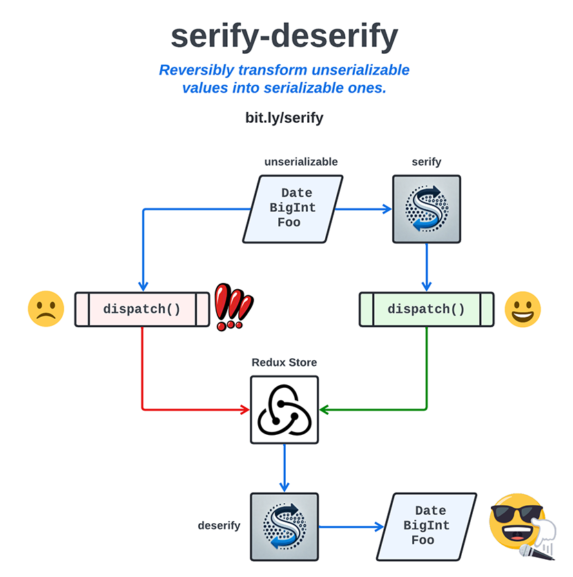

<p align="center" style="font-size: 36pt">serify-deserify</p>

<p align="center"></p>

**serify** - reversibly transform an unserializable value into a serializable one

**deserify** - do the exact opposite

## Why?

`JSON.stringify` and `JSON.parse` are a notoriously bad serializer/deserializer combination. They don't support important Javascript types like `BigInt`, `Date`, `Map`, `Set`, and `unknown`. Thanks to backward compatibility risk, they probably never will.

There are tons of custom serializers that address this issue, notably [`serialize-javascript`](https://www.npmjs.com/package/serialize-javascript) and [`serializr`](https://www.npmjs.com/package/serializr). Unfortunately, some key Javascript tools like [Redux](https://redux.js.org) explicitly depend on `JSON.stringify` & `JSON.parse`. So if you use Redux, none of those fancy serializers will help you get a `Date` or a `BigInt` into your store and back out again in one piece.

`serify` solves this problem by encoding those values (or structures containing them) into values that `JSON.stringify` _can_ serialize without throwing an exception. After these values are retrieved and deserialized with `JSON.parse`, `deserify` returns them to their original state.

## Usage

To install the package, run this command:

```bash
npm install @karmaniverous/serify-deserify
```

Review the unit tests for simple examples of how to use [`serify`](./src/serify/serify.test.ts) and [`deserify`](./src/deserify/deserify.test.ts).

See the [`createReduxMiddleware` unit tests](./src/createReduxMiddleware/createReduxMiddleware.test.ts) for a fully worked out example of how to configure & integrate the Redux middleware.

## Serifiable Types

`serify` and `deserify` will work on values of any serifiable type.

A _serifiable type_ is any type that is:

- reversibly supported by `JSON.stringify` and `JSON.parse`, i.e. booleans, numbers, strings, plain objects, and arrays.
- natively supported by `serify`, i.e. `BigInt`, `Date`, `Map`, `Set`, and `unknown`.
- added to `serify` as a custom type.
- composed exclusively of any of the above (e.g. an array of BigInt-keyed Maps of objects containing Sets of custom class instances).

## serifyKey

`serify` works by converting unserializable values into structured objects that ARE serializable.

Consider the highly unlikely event that some data you want to `deserify` contains objects with exactly this form that were _not_ produced by `serify`:

```
{
  serifyKey: null,
  type: 'Foo',
  value: 'Bar'
}
```

If you are using the [default configuration](./src/options/defaultOptions.ts) (which does not support a `Foo` type), `deserify` will attempt to deserify this object and your process will either fail or produce an incorrect result.

In this case, simply add a non-null `serifyKey` of a serifiable primitive type (meaning a `boolean`, `number`, or `string`) to your `options` object, and everything will work again.

## Options

[Serifiable types](#serifiable-types) and the [`serifyKey`](#serifykey) are defined in an `options` object, which specifies the logic that converts each type to and from a serializable form.

## Cloning in Deserify

`deserify` will not mutate the input value. It clones the value while recursively deserifying its contents.

It is implicitly assumed that the input value is composed entirely of serializable types, otherwise why bother attempting to deserify it?

### Default Configuration

Out of the box, the [`defaultOptions`](./src/options/defaultOptions.ts) object supports the `BigInt`, `Date`, `Map`, `Set`, and `unknown` types.

If you only need the default configuration, simply import the `defaultOptions` object and pass it to `serify` and `deserify`:

```js
import {
  serify,
  deserify,
  defaultOptions,
} from '@karmaniverous/serify-deserify';

// A BigInt test value.
const bigAnswer = 42n;

const serified = serify(value, defaultOptions);
// { serifyKey: null, type: 'BigInt', value: '42' }

const deserified = deserify(serified, defaultOptions);
// 42n
```

### Custom Configuration

If you need to change the `serifyKey` or add custom types, you can create a new `options` object and pass it to `serify` and `deserify`.

For a custom class that doesn't use a [Static Type Property](#static-type-property), the key of the related `serify` type is its class name. For anything else, the logic that determines the key is [here](https://github.com/karmaniverous/serify-deserify/blob/cbf92286f255eac2b5fa2e651f1d5e26a638e737/src/serify/serify.ts#L24-L29).

```js
import { serify, deserify, defaultOptions } from '@karmaniverous/serify-deserify';

// A custom class.
export class Custom {
  public p;

  constructor(p) {
    this.p = p;
  }
}

// A serify options object including support for the new custom type.
const customOptions = {
  ...defaultOptions
  serifyKey: 42,
  types: {
    ...defaultOptions.types,
    Custom: {
      serifier: (value) => value.p,
      deserifier: (value) => new Custom(value)
    }
  }
}

// A Custom test value.
const customAnswer = new Custom(42);

const serified = serify(customAnswer, customOptions);
// { serifyKey: 42, type: 'Custom', value: 42 }

const deserified = deserify(serified, customOptions);
// Custom { p: 42 }
```

### Static Type Property

Normally, a type's key in the serify options object is the type's class name. If a class is dynamically generated, this value may not be known at compile time, so it would not be possible to configure it into the options object in a static manner.

One option is to alter the options object at runtime. _Go nuts!_

Another is to import the `serifyStaticTypeProperty` symbol to create a static property on your class. Use that as type key in your options object.

```js
import {
  serify,
  deserify,
  defaultOptions,
  serifyStaticTypeProperty
} from '@karmaniverous/serify-deserify';

// A custom class.
export class CustomFoo {
  static [serifyStaticTypeProperty] = 'Foo';
  public p;

  constructor(p) {
    this.p = p;
  }
}

// A serify options object including support for the new custom type.
const customOptions = {
  ...defaultOptions
  serifyKey: 42,
  types: {
    ...defaultOptions.types,
    Foo: {
      serifier: (value) => value.p,
      deserifier: (value) => new CustomFoo(value)
    }
  }
}

// A Custom test value.
const customAnswer = new CustomFoo(42);

const serified = serify(customAnswer, customOptions);
// { serifyKey: 42, type: 'Foo', value: 42 }

const deserified = deserify(serified, customOptions);
// CustomFoo { p: 42 }
```

### Typescript

`serify-deserify` is fully type-safe. If you are using TypeScript, you can define your custom types and options objects with full type checking.

This is accomplished by defining a special _type map_ interface that maps a type's name to its types before and after serification. See [`defaultOptions.ts`](./src/options/defaultOptions.ts) to review the default configuration as an example.

Here's the last example again, but with TypeScript:

```ts
import {
  serify,
  deserify,
  defaultOptions,
  serifyStaticTypeProperty,
  type SerifiableTypeMap,
  type SerifyOptions
} from '@karmaniverous/serify-deserify';

// A custom class.
export class CustomFoo {
  static [serifyStaticTypeProperty] = 'Foo';

  constructor(public p: number) {}
}

// Extend the default type map to include your new type.
// The tuple indicates the type before and after serification.
interface FooTypeMap extends SerifiableTypeMap {
  Foo: [CustomFoo, number]
}

// A serify options object including support for the new custom type.
const customOptions: SerifyOptions<CustomFooTypeMap> = {
  ...defaultOptions
  serifyKey: 42,
  types: {
    ...defaultOptions.types,
    Foo: {
      serifier: (value) => value.p,
      deserifier: (value) => new CustomFoo(value)
    }
  }
}

// A Custom test value.
const customAnswer = new CustomFoo(42);

const serified = serify(customAnswer, customOptions);
// { serifyKey: 42, type: 'Foo', value: 42 }

const deserified = deserify(serified, customOptions);
// CustomFoo { p: 42 }
```

## Recursion

In the [Custom Configuration](#custom-configuration) example above, the `Custom` class contains a single property `p` that is populated with a primitive, serializable value (a `number`). So once a `Custom` value is serified with the `serifier` function defined above, there will be no difficulty serializing the `value` property of the resulting object.

What if the `Custom` class contained a property that was itself not serializable? This is the case with the `Map` class, which can contain keys and values of any type, including unserializable ones.

If you look at the [`defaultOptions`](./src/options/defaultOptions.ts) object, you'll see that the `Map` type's `serifier` and `deserfier` functions are quite simple:

```ts
export interface DefaultTypeMap extends SerifiableTypeMap {
  ...;
  Map: [Map<unknown, unknown>, [unknown, unknown][]];
  ...;
}

export const defaultOptions: SerifyOptions<DefaultTypeMap> = {
  types: {
    ...,
    Map: {
      serifier: (value) => [...value.entries()],
      deserifier: (value) => new Map(value),
    },
    ...,
  },
};
```

This works because the `serifier` and `deserifier` functions are applied recursively. They only need to support the direct transformation of a type into a serializable form and back again, without regard to the resulting _contents_... so long as those contents are _also_ composed of serifiable types.

## Redux

The `createReduxMiddleware` function generates a Redux middleware that will
serify every value pushed to your Redux store. If you use
[Redux Toolkit](https://redux-toolkit.js.org/), leave the default
`serializeCheck` middleware in place and it will notify you if you need to add a
new type to your serify options!

When retrieving values from the Redux store, either deserify them explicitly or
wrap your selectors in the `deserify` function.

See the [`createReduxMiddleware` unit tests](./src/createReduxMiddleware/createReduxMiddleware.test.ts) for a fully worked out example with custom types, or just try this for the out-of-the-box experience (H/T [@tuffstuff9](https://github.com/tuffstuff9)):

```ts
import {
  createReduxMiddleware,
  defaultOptions,
} from '@karmaniverous/serify-deserify';

// Create middleware.
const serifyMiddleware = createReduxMiddleware(defaultOptions);

// Construct slice.
const testSlice = createSlice({
  name: 'test',
  initialState,
  reducers: {
    setValue: (state, { payload }: PayloadAction<TestState['value']>) => {
      state.value = payload;
    },
  },
});

// Configure redux store.
const store = configureStore({
  reducer: combineReducers({
    test: testSlice.reducer,
  }),
  middleware: (getDefaultMiddleware) =>
    getDefaultMiddleware().concat(serifyMiddleware),
});
```

---

See more great templates and other tools on
[my GitHub Profile](https://github.com/karmaniverous)!
